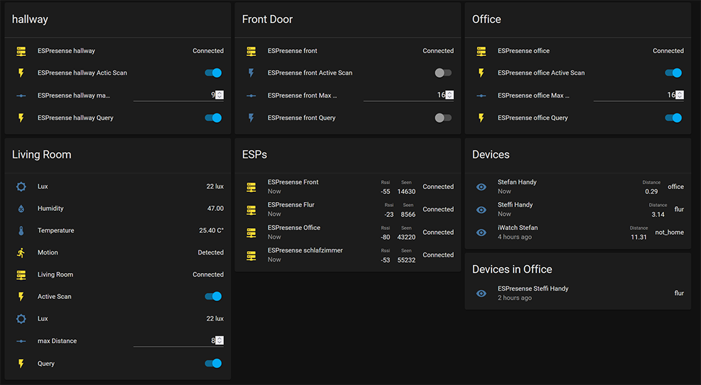

#  ESPresense

An ESP32 based presence detection node for use with the [Home Assistant](https://www.home-assistant.io/) [`mqtt_room` component](https://www.home-assistant.io/components/sensor.mqtt_room/) for localized device presence detection.

**Documentation:** https://espresense.com/

**Building:** [building](./BUILDING.md).

**Release Notes:** [changelog](./CHANGELOG.md).

# Features and Differences from ESP32-mqtt-room

- SUPER Easy Browser based installation
- Captive portal for easy WiFi setup
- Home Assistant MQTT Discovery for easy HA configuration
- Auto-updates by downloading github released bin (with a preference if you don’t want this)
- Uses a fingerprint instead of mac addresses so we can track randomized mac devices (like Apple Watches and iOS devices)
- Filters measured distance with botah a median prefilter and a Kalman filter (reduces jitter for more accuracy)
- Fully multithreaded, uses constant BLE scanning, doesn’t disable wdt (more reliable)
- Additional AppDaemon app that attempts to solve indoor position (x,y,z) with multiple ESPresense stations using multilateralization.
- Additional Sensors useable via GPIO

# Additional Sensors supported

## Motion:
- PIR Motion Sensor [HC-SR501](https://github.com/burrsutter/rpi_HC-SR501)
- Radar Sensor [RCWL-0516](https://github.com/jdesbonnet/RCWL-0516)

## Ambient Sensor (lux):
- Ambient Sensor [GY-302 BH1750](https://randomnerdtutorials.com/esp32-i2c-communication-arduino-ide/)

## Temperature and Humidity Sensor :
- DHT temperature & humidity sensor [DHT11](https://learn.adafruit.com/dht)
- DHT temperature & humidity sensor [DHT22](https://learn.adafruit.com/dht)

# How to use
- [Motion Sensor](docs/Motion.md)
- [DHT Sensor](docs/dht.md)
- [Ambient Sensor](docs/ambient.md)

# Home Assistant View

