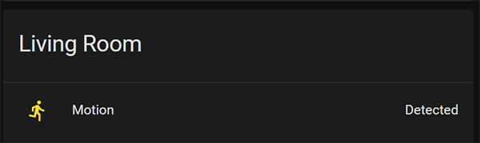
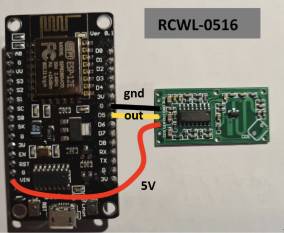

#  ESPresense - Motion Sensors

Use  PIR Motion Sensor (HC-SR501) or Radar Sensor (RCWL-0516) for motion detection
Creates a new Motion Entity if Autodiscover is selected. 
This is additional and does not impact the BLE functions.

## Supported Sensors:
- For PIR Motion Sensor[ (HC-SR501) ](https://github.com/burrsutter/rpi_HC-SR501)
The Sensor is some kind of slow. After Detection, it needs some time to get the next detection.

- For Radar Sensor [(RCWL-0516)](https://github.com/jdesbonnet/RCWL-0516) 
Fast Sensor which have some benefits above the Pir Sensor. 
As shown on the picture below, connect the data pin with gpio pin27 on the ESP32.

# Home Assistant view

# How to use
- Open the URL of your ESP in a Browser
- Enter the GPIO Pin into the settings menu
- Click Save
- Restart

# Pin Layout
Example:

