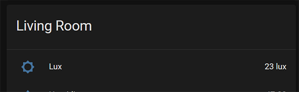
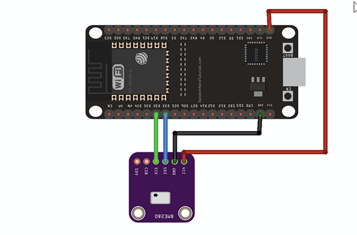

#  ESPresense - Ambient Sensor

Adds support for a GY-302 BH1750 Sensor
This is additional and does not impact the BLE functions.

## Supported Sensors:
- Ambient Sensor [GY-302 BH1750](https://www.instructables.com/BH1750-Digital-Light-Sensor/)

# Home Assistant view

# How to use
- Open the URL of your ESP in a Browser
- Use the auto-detect function to get the address
- Enter the GPIO Pin into the settings menu
- Click Save
- Restart

# Pin Layout
Example:

