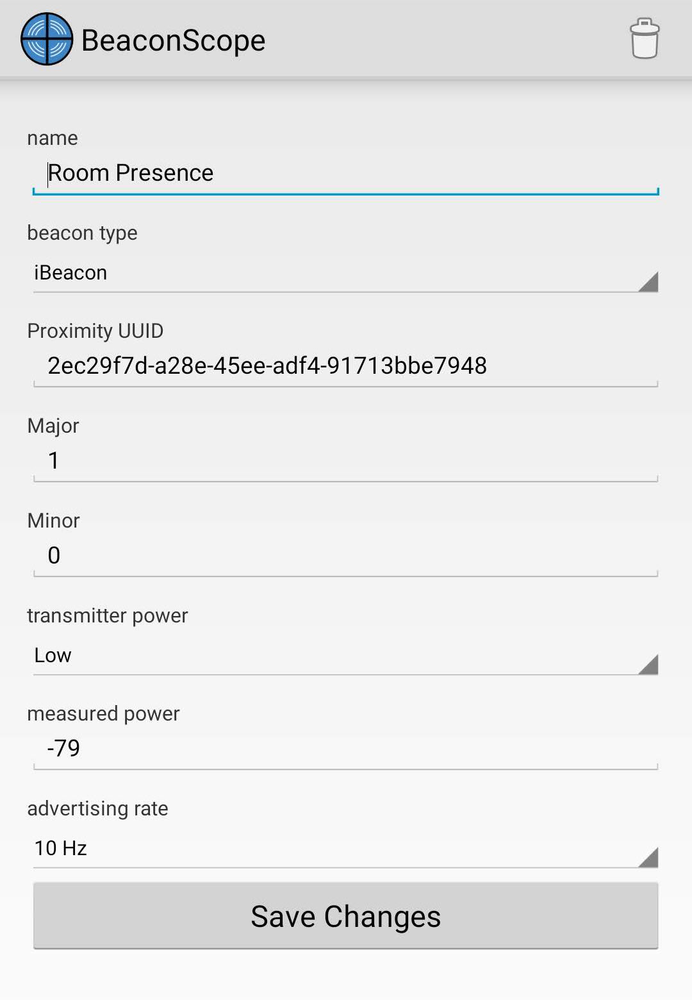

# Tracking an Android phone


It is possible to track your Android phone by installing a simple beacon broadcasting app. I have used [Beacon Simulator](https://play.google.com/store/apps/details?id=net.alea.beaconsimulator) and [Beacon Scope](https://play.google.com/store/apps/details?id=com.davidgyoungtech.beaconscanner).

### Setup
You can use any iBeacon UUID in the app. Whatever you choose, ensure that it matches exactly with your entry in the Home Assistant configuration, including both the `major` and `minor` version numbers. An example phone configuration could be:
```
device ID: 2ec29f7da28e45eeadf491713bbe7948
major version number: 1
minor version number: 0
```
and the corresponding Home Assistant configuration would be:
```yaml
- platform: mqtt_room
  device_id: "2ec29f7da28e45eeadf491713bbe7948-1-0"
  name: 'Phone bt_room'
  state_topic: 'room_presence'
  timeout: 10
  away_timeout: 15
```

### Why an App?
Both Android and iPhone use a strategy of [Bluetooth MAC address randomization](https://source.android.com/devices/tech/connect/wifi-mac-randomization) to prevent tracking. While this may not be a perfect solution, it means that the publicly-available bluetooth MAC address of your phone won't be consistent to devices with which it has not bee paired. As we're using Bluetooth Low Energy to scan, we don't want to pair the device. Thus, the need for an app to allow us to track.

### Known Issues
With the release of advanced battery management, Android now has a habit of killing background processes. This means that you may not be able to track your phone consistently. I have yet to find a solution for this problem - if you know of one, please open an issue.
