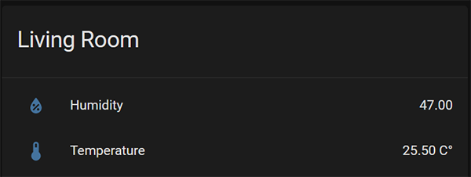
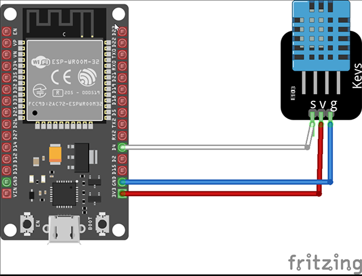

#  ESPresense - Temperature and Humidity Sensors

This is additional and does not impact the BLE functions.

## Supported Sensors:
- DHT temperature & humidity sensor [DHT11](https://learn.adafruit.com/dht)
- DHT temperature & humidity sensor [DHT22](https://learn.adafruit.com/dht)

# Home Assistant view

# How to use
- Open the URL of your ESP in a Browser
- Enter the GPIO Pin into the settings menu
- Click Save
- Restart

# Pin Layout
Example:

