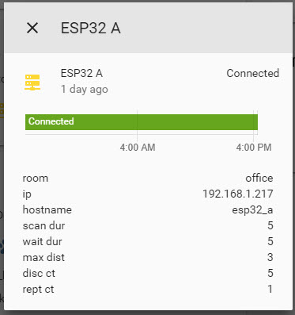

# Home Assistant Configuration
Once the ESP32 is running, it is important to configure Home Assistant to use the information from the MQTT topic to determine what devices to track. You can read the full documentation [on the Home Assistant website](https://www.home-assistant.io/components/sensor.mqtt_room/). It is critical that you configure your device IDs to include the Major and Minor versions, in the format `{{beacon uuid}}-{{major}}-{{minor}}`

To obtain a `{{beacon uuid}}-{{major}}-{{minor}}`, you need to setup a beacon following one of the guides:
- [Android](./android.md)
- [Beacons](./beacons.md)
- [generic_ble](./generic_ble.md)

### configuration.yaml
Here is an example of how an entry into your `configuration.yaml` file should look:
```yaml
sensor:

# One entry for each beacon you want to track
  - platform: mqtt_room
    device_id: "fda50693a4e24fb1afcfc6eb07647825-5-0" # Note that major version must match, but any minor version will be ignored
    name: 'ESPresense Presence'
    state_topic: 'espresense'
    timeout: 60
    away_timeout: 120

binary_sensor:

# One entry per sensor node to understand when the device is online/offline and see device metadata such as IP address and settings values
  - platform: mqtt
    name: ESP32 A
    state_topic: "espresense/rooms/esp32_a/status"
    json_attributes_topic: "espresense/rooms/esp32_a/telemetry"
    payload_on: "online"
    payload_off: "offline"
    device_class: connectivity
```
Binary sensor with telemetry in the lovelace UI:


