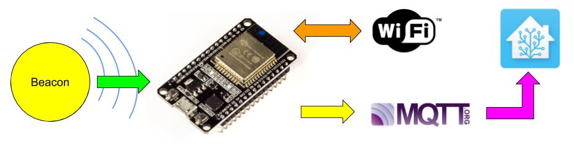
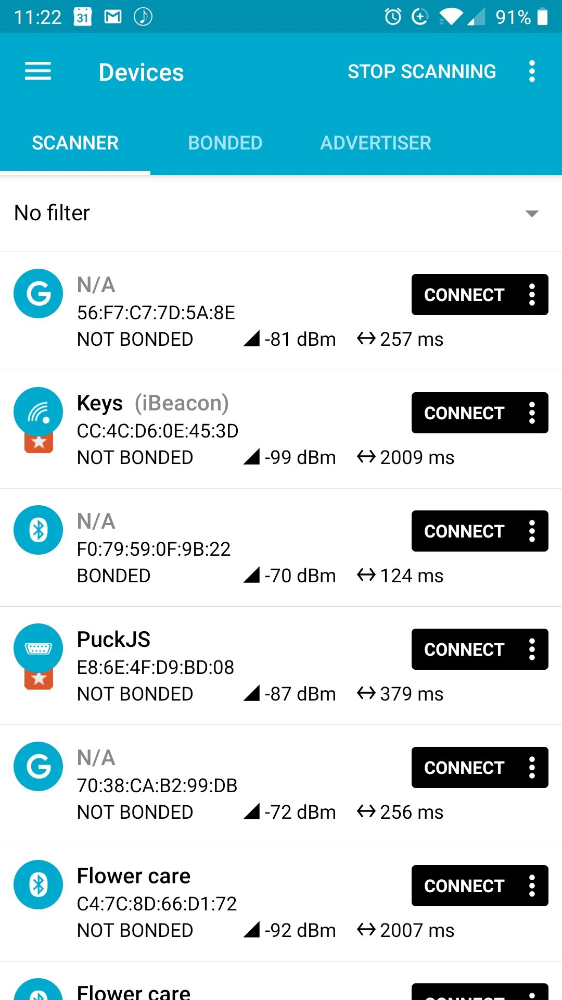
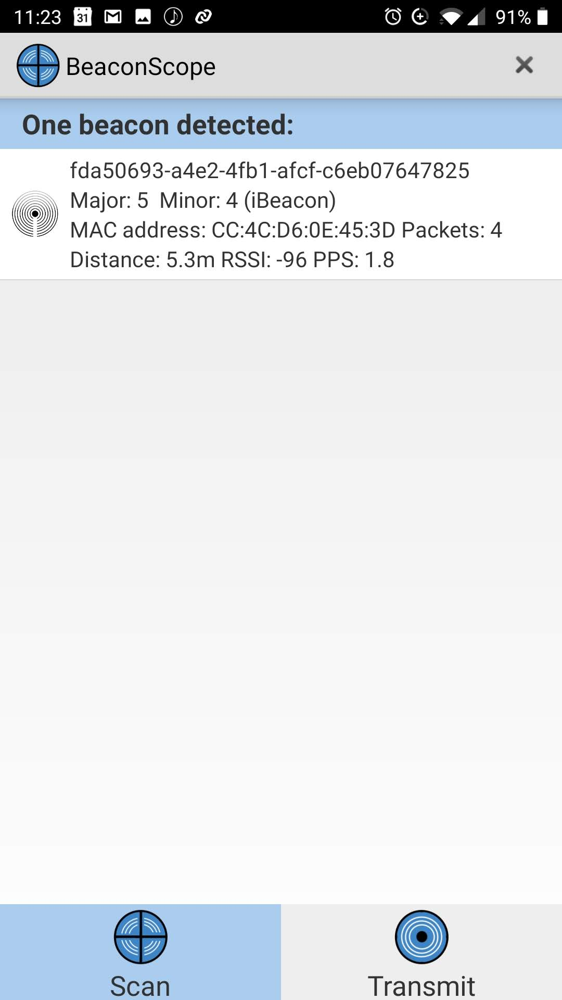
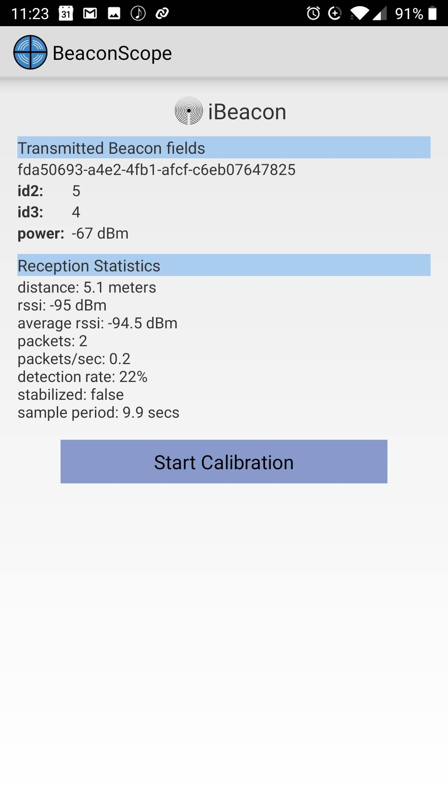
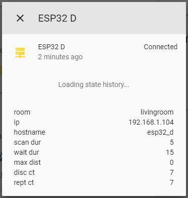

# Troubleshooting
It can be a challenge to troubleshoot problems with tracking a beacon, as the problem can exist in different places in the "information pipeline." The flow of information can be visualized in the following way:



1. Beacon broadcasts an advertisement packet.
2. ESP32 collects the broadcast (green arrow)
3. ESP32 verifies connection to WiFi (orange arrow)
4. ESP32 verifies connection to MQTT (yellow arrow)
5. MQTT publishes data to `room_presence` topic (purple arrow)
6. Home Assistant parses information and reports configured sensorsiot

## Build/Upload
Occasionally you may encounter errors when trying to build and upload the code for the first time, or after a new version has been released. This is usually caused by a change to the required values provided in your configuration file, which may have changed.

It's a good idea to check out the [release notes](./releaseNotes) to see if anything has changed that requires action on your part to have the build succeed.

## Logging
There are various logs that can help identify the step in the information flow that is the broken link in the chain. If you're submitting an issue, be sure to include the logs that show the problematic behaviour

### Broadcasting (green arrow)
To view the advertisements coming from your beacon, you can use an App on a BLE-enabled device. I recommend using [NRF Connect](https://play.google.com/store/apps/details?id=no.nordicsemi.android.mcp) for Android to view all advertised devices in your area. Once you've found the device you're interested in, you can use [Beacon Scope](https://play.google.com/store/apps/details?id=com.davidgyoungtech.beaconscanner) to connect to and view information about your beacon, which can help in determining the correct setup.





If you do not see your device advertising, then you know that the problem lies in your beacon device itself, rather than with this project.

### ESP32 WiFi (orange arrow)
Your ESP32 will attempt to connect to the wireless network you specified in your configuration file. While disconnected, the on-board status LED (if available) should be lit, in addition to the power LED (which is always on when the ESP32 is powered up).

You can connect to your ESP32 over a USB cable and open a serial monitor (there is one built into PlatformIO, or you can use another serial monitor such as the Arduino IDE or putty on Windows). Reset the device (using the on-board reset button), and watch the messages that are logged. You should see a message indicating that it connected to your WiFi, and the IP address it has been assigned.
```
Connecting to WiFi...
[WiFi-event] event: 0Wifi Ready
[WiFi-event] event: 2STA Start
[WiFi-event] event: 4
[WiFi-event] event: 7
IP address:   192.168.1.104
Hostname:       esp32_d
Connecting to MQTT
Stopping wifi reconnect timer
```

If your device won't connect to your wireless network, copy and paste any logs you see into your issue.

### ESP32 MQTT (yellow arrow)
To report devices, the ESP32 must be connected to your MQTT server. It will attempt to connect once it has established a connection to your wireless network. Once connected, the device will publish a status message ("CONNECTED") to the `availabilityTopic` as defined in your settings. It also publishes your configuration information to the `telemetryTopic` which consists of:
* **room**: the configured room name
* **ip**: the assigned IP address of the device
* **hostname**: the host name, used for WiFi as well as client ID for MQTT (must be unique on your network)
* **scan_dur**: the scan duration, in seconds
* **wait_dur**: the wait duration between scans, in seconds
* **max_dist**: the maximum distance within which to report devices, in meters
* **disc_ct**: the number of devices discovered in the last scan
* **rept_ct**: the number of devices reported in the last scan (this is all discovered devices where the distance is beneath the max_dist threshold)



If you do not see any information being published to either the `availabilityTopic` or `telemetryTopic` then you will want to connect to the serial monitor and check the logs. Verify that your MQTT user name and password is correct, and check the logs on your MQTT server itself. You should see it reporting a new client connected from the ESP32's IP address:
```
New client connected from 192.168.1.104 as esp32_d (c1, k60, u'my_mqtt_username').
```

### Home Assistant (purple arrow)
In order to see devices, you will need to [configure Home Assistant correctly](./home_assistant). You can add a device as an iBeacon, or you can add [generic BLE hardware](./generic_ble) using its hardware MAC address.

To view what devices are being reported on the MQTT topic, you can use a tool such as [mosquitto_sub](https://mosquitto.org/man/mosquitto_sub-1.html) to connect to and view what is being reported. This will provide you with the data format you'll need to follow when writing the configuration:
```
mosquitto_sub -h {{mqtt server IP address}} -u {{my mqtt user}} -P {{my mqtt password}} -i presence-information -v -t "room_presence/#" | ts
```
